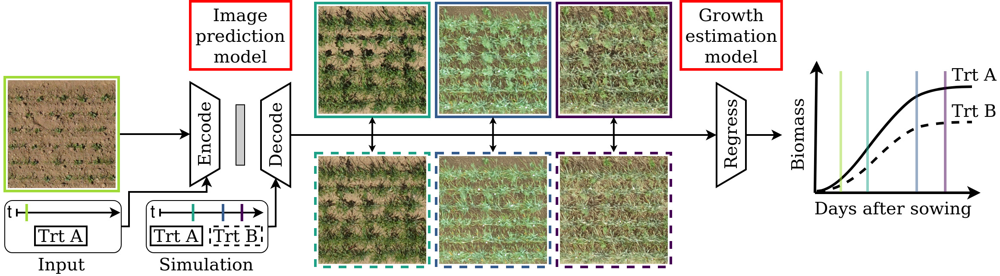

# Conditional GANs for Crop Growth Simulations


**Picture:** *Generate images of different crop mixture growth stages under simulated different treatments.*

[Data-driven Crop Growth Simulation on Time-varying Generated Images using Multi-conditional Generative Adversarial Networks](https://doi.org/10.48550/arXiv.2312.03443) (arXiv 23)

## Requirements

A suitable conda environment can be installed from the provided package file environment.yml

    conda env create -f environment.yaml
    conda activate crop-growth-cgan

## Data
All datasets used in this work are publicly available: [Arabidopsis](https://doi.org/10.5281/zenodo.168158) (re-calibrated): abbreviated **abdc**, [MixedCrop-CKA](https://phenoroam.phenorob.de/geonetwork/srv/eng/catalog.search#/metadata/751c10c4-b6dc-4bcc-bc8c-c0fc5920887a): **mix**, [MixedCrop-WG](https://phenoroam.phenorob.de/geonetwork/srv/eng/catalog.search#/metadata/d9d0434f-7864-435e-9c75-56102d9332cb): **mix-wg**, [GrowliFlower](https://phenoroam.phenorob.de/geonetwork/srv/eng/catalog.search#/metadata/cb328232-31f5-4b84-a929-8e1ee551d66a): **grf**

Data preprocessing scripts and process-based simulation files will be available soon. Please contact the author for further information.

## Training
There are train scripts depending on which conditions are to be considered for the multi-conditional GAN. The conditions are input images (**img**), the time or growth stage (**t**), treatment information as class variables (**cls**) and other influencing factors (**if**), such as in this case daily simulated biomass.
A training can be started after setting the requirered parameter in the corresponding config file in ./configs/ (descriptions in the file).

    python train_img_t_cls.py

Thereby the settings from ./configs/config_train_img_t_cls.py are used. For other train scripts accordingly.
To resume a previous training, please enter the experiment name there and ensure, that architecture parameters are consistent.

## Testing
To test a model trained with the above command

    python test_img_t_cls.py
    
You need to specify at least the log dir and the experiment name which you want to evaluate in ./configs/config_test_img_t_cls.py.
Beyond that per default all parameters used to train the model are also used for testing. But you can also try to change e.g. the dataset e.g. from **mix** to **mix-wg**.
Weights of the growth estimations models will be provided soon and should be saved in the folder ./eval_model_weights.

## Citation
If you use this code for your research, please cite our paper.
```
@Article{drees2023datadriven,
  author  = {Lukas Drees and Dereje T. Demie and Madhuri R. Paul and Johannes Leonhardt and Sabine J. Seidel and Thomas F. Döring and Ribana Roscher},
  title   = {Data-driven Crop Growth Simulation on Time-varying Generated Images using Multi-conditional Generative Adversarial Networks},
  journal = {arXiv preprint arXiv:2312.03443},
  year    = {2023},
  doi     = {10.48550/arXiv.2312.03443},
}
```
